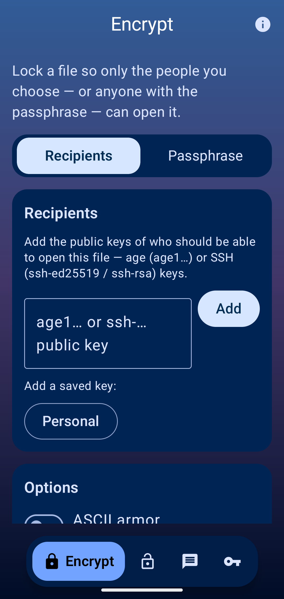
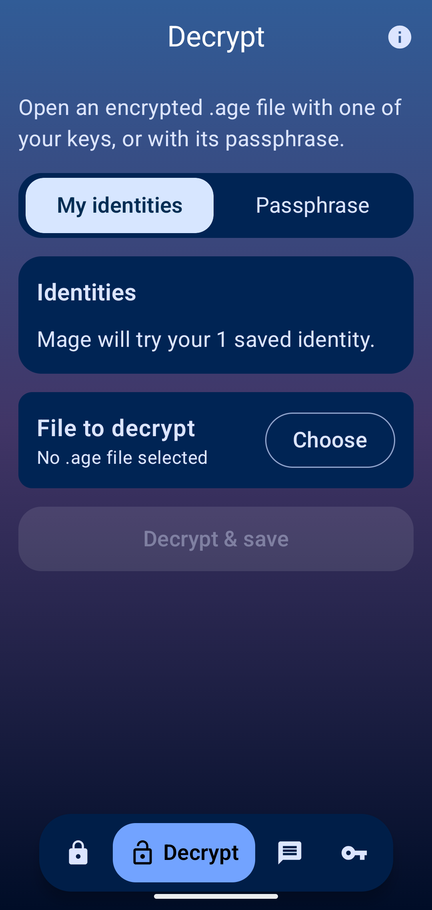
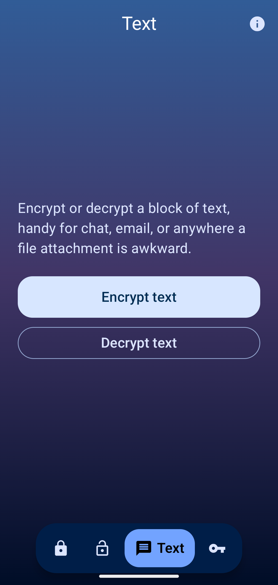
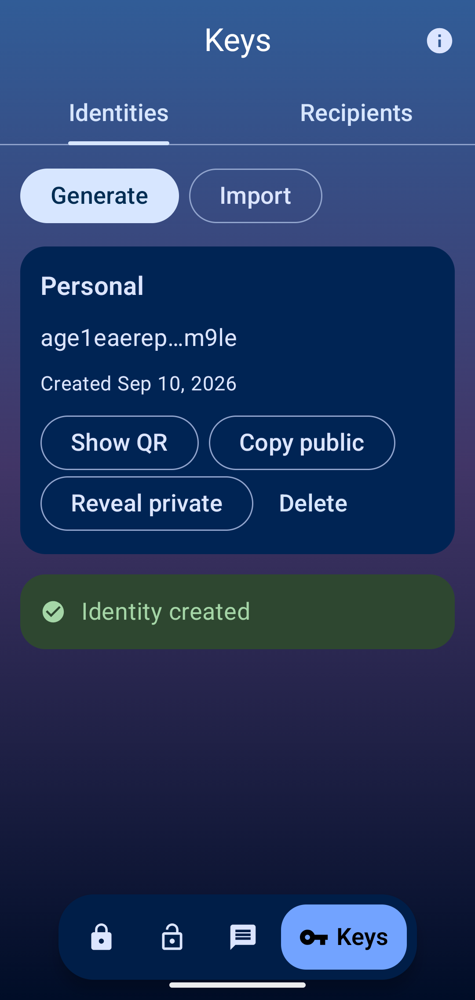

# Mage

<p align="center"></p>

Mage is an Android GUI for [age] file encryption, built on [kage] (a Kotlin/JVM
implementation of the age protocol). "Mage" is short for *Mobile age*. Mage is not
officially affiliated with or endorsed by the age project.

The minimum supported Android version is API 26.

## Download

[](https://github.com/ElCruncharino/mage/releases/latest)
[](https://f-droid.org/packages/dev.mage.age/)
[](https://github.com/ImranR98/Obtainium)

For Obtainium, add an app with the URL `https://github.com/ElCruncharino/mage`.

Releases are signed and built by CI directly from a tagged commit (see
`.github/workflows/release.yml`).

### Verification

Every release APK is signed with the same key. To confirm a downloaded APK is
genuine, verify it with
[`apksigner`](https://developer.android.com/tools/apksigner):

```sh
apksigner verify --print-certs Mage-<version>.apk
```

The certificate's SHA-256 fingerprint should match:

```
b72ba7c9b6fe10c0aacc141cde5eb1ffe3e47d7473ca68b9cc339dd0d4fdcfa3
```

## Screenshots

<p align="center">




</p>

## What it does

- Encrypt/decrypt files to age recipients (`age1...`) or passphrases, including armor,
  multi-recipient, and encrypt-to-self.
- A Text screen for short messages: paste or type, pick recipients or a passphrase, and
  get back an ASCII-armored block to copy or share, no file involved.
- Post-quantum identities (`age1pq...`) alongside classic X25519 keys, though they
  can't be mixed with other recipients on the same file.
- SSH keys (`ssh-ed25519`, `ssh-rsa`) work as recipients and identities alongside native
  age keys, and can be mixed on one file.
- Identities are sealed in the Android Keystore (AES-256-GCM, StrongBox where available)
  behind biometric/device-credential auth. Recipients get a small address book with QR
  encode/scan for sharing a public key.
- Batch mode for encrypting/decrypting more than one file at a time into a folder.
- Encrypted export/import of your identity vault, so it's not stuck on one device.
- Hooks into the system: share-sheet targets, the text-selection menu, a `.age`
  file-manager association, launcher shortcuts, a Quick Settings tile.

## Status

Early. Currently at [v0.1.6](https://github.com/ElCruncharino/mage/releases/tag/v0.1.6),
now also on F-Droid. Built and tested against real kage on a JVM harness plus device
testing. Not independently audited. Treat it accordingly.

## Building

kage is pulled in as a git submodule, tracking upstream `android-password-store/kage`
directly, and built as a composite build (see `settings.gradle`); edits to the library
apply straight to the app with no publish step. That's handy for testing kage changes
before they're upstreamed or before a numbered release ships them. Swap it for a plain
`com.github.android-password-store:kage` version coordinate if you don't need that.

```sh
git clone --recursive https://github.com/ElCruncharino/mage.git
cd mage
./gradlew assembleDebug
```

If you already cloned without `--recursive`, run `git submodule update --init` first.

## Non-goals

- Its own crypto implementation. That's kage's job, Mage is only the GUI.
- A general-purpose file manager or password manager.
- age-plugin support: the reference plugin mechanism shells out to binaries on `$PATH`,
  which doesn't work on Android.

## License

Licensed under either of

 * Apache License, Version 2.0, ([LICENSE-APACHE](LICENSE-APACHE) or
   http://www.apache.org/licenses/LICENSE-2.0)
 * MIT license ([LICENSE-MIT](LICENSE-MIT) or http://opensource.org/licenses/MIT)

at your option.

### Contribution

Unless you explicitly state otherwise, any contribution intentionally submitted for
inclusion in the work by you, as defined in the Apache-2.0 license, shall be dual
licensed as above, without any additional terms or conditions.

[age]: https://age-encryption.org/v1
[kage]: https://github.com/android-password-store/kage
